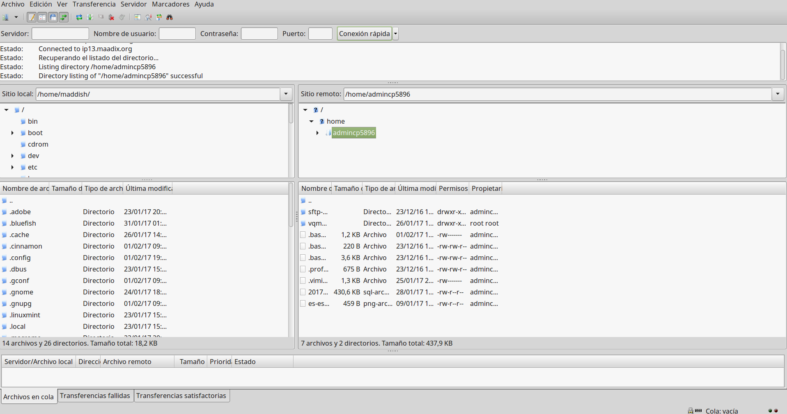

# Activar dominio
El primer paso para poder crear un sito web accesible dedsde cualquier navegador, es activar un dominio o subdominio para él.  
Si todavía no has completado este paso, puedes encontrar instrucciones sobre como proceder aquí: [Activar Dominio](dominios.md)

# Subir contenidos

Una vez tengas activado el dominio para tu nuevo sito web, tendrás que subir los archivos de tu aplicación a la carpeta correspondiente.  
Esta carpeta se encuentra en /var/www/html/midominio.com   

Puedes acceder a esta ubicación y subir los archivos utilizando  un cliente sftp. Hay varias soluciones para ello. Si no tienes ningún cliente sftp instalado y no sabes cual escojer te aconsejamos [Filezilla](https://filezilla-project.org/).  
 
Tendrás que establecer una conexión con tu servidor para poder proceder. El cliente sftp te pedirá una serie de credenciales para llevar a cabo dicha conexión:  

* Servidor: el nombre de tu espacio en MaadiX (myservername.maadix.org)  
* Protocolo: SFT/SSH  
* Modo de acceso: Normal  
* Usuario: El nombre de usuario que has establecido como webmaster para el dominio  
* Contraseña: La contraseña que has establecido para este usuario

Según el tipo de usuario que estés utilizando para la conexión tendrás acceso a diferentes contenidos en el servidor.  

# Usuario de Sistema 
Si no has creado ningún usuario webmaster para tu nuevo dominio, estás accediendo con el usuario de sistema que es el propietario de la carpeta web en /var/www/html/midominio.com  

Este es un usuario con altos privilegios y que tiene acceso a todo el sistema. Cuando estableces la conexión al servidor utilizando este usuario, la ubiciación el la que te encuentras nada más empezar la sesión es la carpeta personal, o sea /home/nombrei_ de_usuario.  
Desde esta ubicación no puedes ver todavía la carpeta /var/www/html/midominio.com que es donde tienes que subir los archivo.  

Para acceder a ella puedes insertar la ruta /var/www/html/midominio.com en el campo "Sitio remoto"  (Por supuesto tendrás que sustituir midominio.com por tu dominio real).

 

En esta carpeta hay dos elementos: Una carpeta con nombre .well-known y un archivo index.html.  
La carpeta .well-known es necesaria para la conexión segura a la web (https) y no debes tocarla. El punto delante del nombre de carpeta significa que es un archivo oculto, por lo que si no se muestra no te preocupes. Está ahí pero tu cliente sftp está configurado para no mostrar los archivos ocultos.  

El archivo index.html es un archivo que se crea en el proceso de activación del dominio y no tiene otra finalidad que la de comprobar que la activación se ha completado con éxito. 
 
Si vistas con un navegador tu doiminio antes de subir tus propios archivos, encontrarás una página de bienvenida que es el contenido de este archivo index.html.  
Puedes ahora borrar (o sobrescribir) este archivo index.html existente y  subir los de tu aplicación.  

# Usuario Webmaster  

Si has asignado un usuario webmaster específico para tu nuevo dominio tendrás que utilizar sus credenciales para la conexión ya que éste será el propietario de la carpeta del dominio y solo él podrá escribir en ella.
Los usuarios webmaster no tienen acceso a todos los archivos como tiene el usuario de sistema. Cuando un usuario webmaster establece la conexión verá una carpeta con su propio nombre.  

En ella encontrará todas las carpetas de los dominios por los que ha asignado como webmaster.  

  

