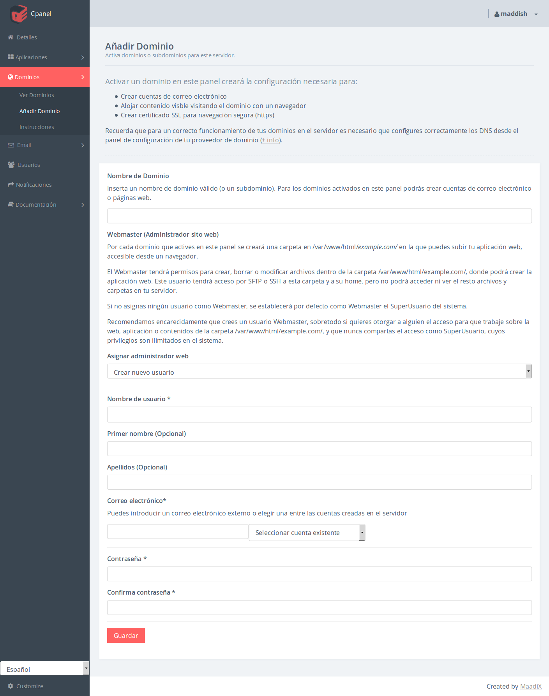

# Copmrar dominio

De momento Maadix no ofrece el servicio de registro de dominios. Esto no es un problema, ya que puedes adquirir fácilmente  tu dominio a cualquier proveedor. Si no sabes con cual proveedor registrarlo, aquí te dejamos un pequeño listado con algunas opciones (hay muchísimos más):

* [gandi.net](https://www.gandi.net/)
* [Namecheap.com](https://www.namecheap.com/domains/registration.aspx)
* [dinahosting.com](https://dinahosting.com/dominios)

Y aquí tienes un listado completo de las empresas acreditadas por el ICANN:   
[Ver listado](https://www.icann.org/registrar-reports/accredited-list.html)

Una vez tengas un dominio registrado tendrás que aplicar un par de configuraciones tanto en el Cpanel de tu servidor como en el panel del proveedor donde compraste el dominio.

## Activar dominio
El primer paso para que el dominio funcione y muestre tus aplicaciones es activarlo en el Cpanel.  
Desde el Cpanel Entra en la pestaña 'Dominios' y haz click en  'Añadir dominios'. 
Se desplegará un formulario con los siguientes campos:

* Nombre de dominio:  inserta el nombre de dominio completo , o un subdominio (por ejemplo example.com o docs.example.com)

* Contraseña: esta contraseña se puede utilizar para acceder al panel de control como administrador del dominio identificándose con  
* User: Nombre Dominio 
* Contraseña: La que insertes en este campo

 El administrador de dominio tiene privilegios limitados y sólo podrá crear, editar y borrar las cuentas de cooreo electrónico asociadas a su dominio. No podrá en ningún caso acceder a ninguna otra función y no podrá eliminar el dominio.  

* Webmaster (Administrador sito web): por cada dominio que actives en el panel de Control se creará una carpeta en /var/www/html/ en la que puedes subir tu aplicación web que será así accesible desde el navegador.  
  

Para cada dominio o subdominio que añadas a tu sistema, puedes asignar un administrador web (Webmaster).  
El administrador web tendrá permisos para crer, borrar o modificar archivos dentro de esta carpetas y poder así crear la aplicación web.  Puedes elegir un usuario ya creado o crear uno nuevo.  
 Si no asignas ningún usuario se establecerá como webmaster al usuario de sistema ( el primero que encuentras en el listado de la página 'Usuarios').

Si creas un unevo usuario tendrás que asignarle un nombre y una contrasesña, que utilizará para acceder a la carpeta recién creadae en el servidor. Podrá acceder por sftp o por ssh.  

 

El sistema puede tardar hasta 5 minutos en completar la nueva configuración. Para saber si el proceso ha terminado refresca la página 'Dominios' y averigua que  la columna 'Status' tenga el check verde

  

Ahora ya puedes subir los archivos de tu aplicación web a la carpeta para mostrar tus contenidos.  

Puedes econtrar más indicaciones aquí:  
[Crear Web](create-web)
 
## DNS

 Cuando registramos un dominio hay un apartado en su configuración llamado DNS. Los DNS son los que pemiten transfomar nombres de dominio entendibles por humanos, en números que corresponden a las diferentes máquinas conectadas y accesibles públicamente en internet.

Para que tu dominio funcione correctamente para tus servicios tendrás que aplicar las configuraciones correspondientes.

Entra en tu panel de control en la sección Dominios.
Ahí encontrarás el listado de los dominios y para cada uno puedes averiguar que la configuración de los DNS sea correctaa.  
Si se detecta una configuración erronea tendrás que aplicar los cambios desdeel àrea cliente de tu provedor de dominio.
