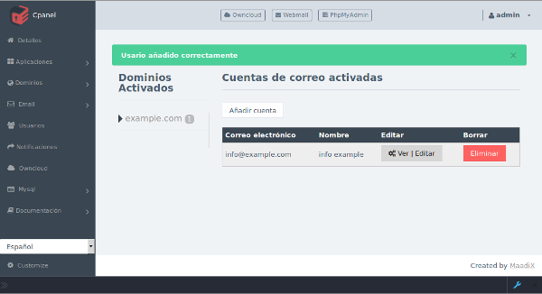

# Email

Puedes añadir infinitas cuentas de correo para todos los dominios que tengas activados en tu servidor.  
Antes de añadir cuentas de correo electrónico, es importante que te asegures de haber configurado correctamente el dominio correspondiente. Para saberlo, consulta [Configuración de dominio](/dominios).

# Crear cuenta

En la sección 'Email', haz clic en el botón 'Añadir cuenta' y rellena los diferentes campos del formulario que se despliega. Tendrás que elegir un dominio del listado de dominios disponibles, el cual habrás activado previamente en la sección 'Domminios'.

# Editar cuenta 

Puedes cambiar los parámetros de las cuentas de correos electrónico que tengas activadas visitado la sección **'Email'** y haciendo clic luego en el botón Ver | Editar de la cuenta que desees modificar.

# Reenvío automático

En la misma página de edición de cada cuenta de correo electrónico puedes activar el renvío automático de todo el correo entrante a cualquier otra dirección de correo.  

Para hacerlo, tienes que activar la casilla **Activar reenvío automático a otra cuenta**, insertando una dirección válida en el nuevo campo que se despliega. En caso de que quieras que se reenve a múltiples cuentas, debes separar cada una con coma (user1@example.com,user2@example.com). Si quieres seguir recibiendo una copia de los correos entrantes en tu cuenta actual, tendrás que incluirla en el listado.

# Eliminar cuenta

Cuando eliminas una cuenta de correo, los mensajes de sus carpetas (recibidos, enviados, papelera...) no se borran y se guarda una copia en tu servidor. La cuenta es desactivada, de modo que no podrá seguir enviando o recibiendo correo. Si en un futuro vuelves a crear la misma cuenta, recuperarás todo el contenido de sus carpetas.
Para vaciar definitivamente una cuenta de correo, puedes borrar su contenido utilizando la interfaz webmail (si tienes la aplicación instalada) o utilizando un cliente de correo electrónico (Thunderbird, Outlook...) configurada con IMAP. IMAP crea una sincronización entre el cliente y el servidor, de manera que todas las acciones efectuadas en una de las dos partes se refleja en la otra.

# Webmail - Rainloop

Si has instalado la aplicación Rainloop en tu servidor, podrás utilizar esta herramienta webmail para consultar y enviar correo electrónico desde tu navegador.  
Desde el panel de control mismo tienes un acceso directo a la aplicación webmail. Además de poder utilizar la dirección tusubdominio.maadix.org/rainloop, también puedes utilizar cualquier dominio propio que tengas funcionando en el servidor.  
Si, por ejemplo, has configurado con éxito el dominio example.com para tu servidor, puedes visitar la interfaz webmail visitando https://example.com/rainloop     

Todas las cuentas de correo electrónico activadas correctamente a través del panel de control pueden ser consultadas a través de la interfaz webmail.

# Cliente de correo
MaadiX favorece que puedas administrar tu correo electrónico utilizando un cliente de correo que tengas instalado en tu ordenador (Thunderbird, Outlook...).
Con tal de poder configurar tu cuenta dentro del cliente, necesitas los datos de conexión al servidor, que puedes encontrar en la página Ver | Editar de cualquier cuenta de correo que hayas creado.  

