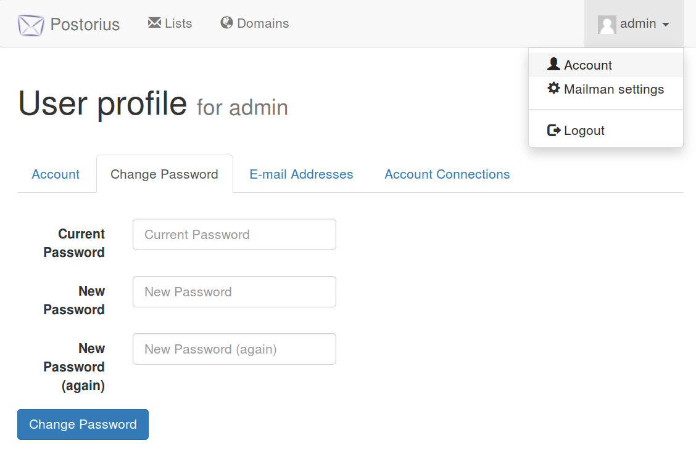
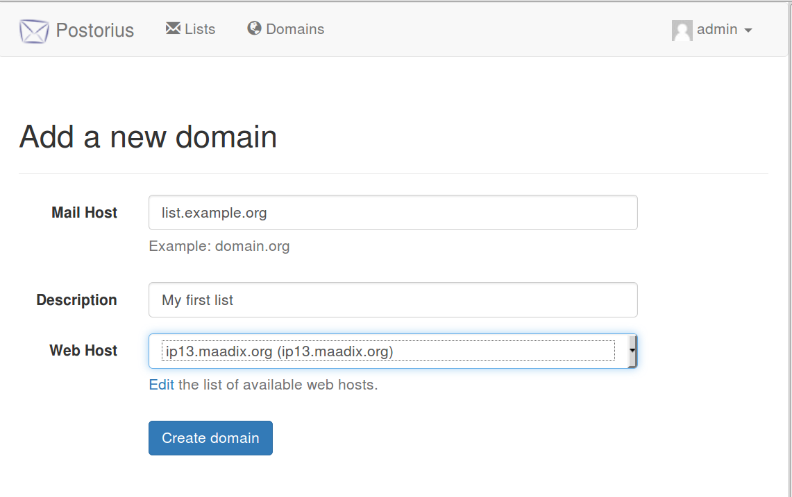
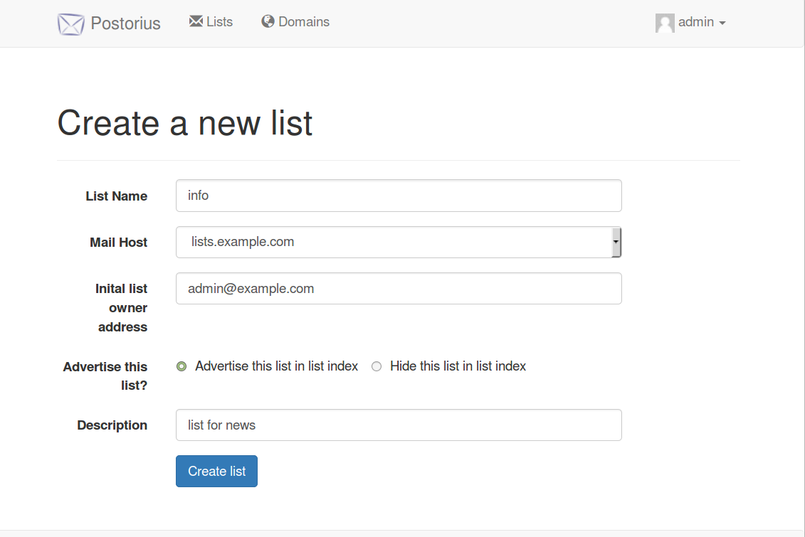
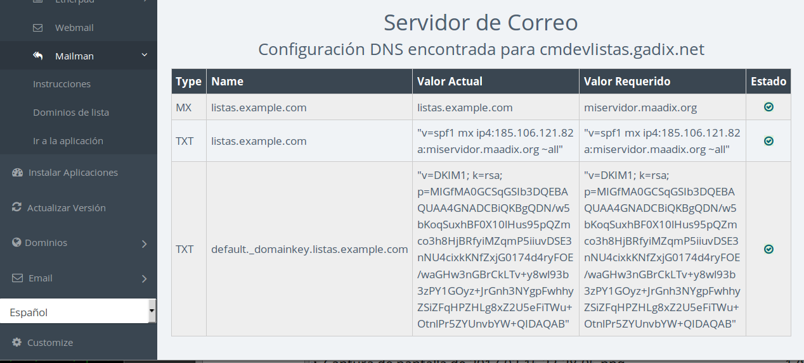

# Introdución  

Mailman es un software que permete crear y administrar listas de correo electrónico y boletines (newsleeter).
Comprende tres diferentes interfaces web.

* **Admministración**    
* **Gestión de listas**    
* **Archivos de listas**    

Si has instalado mailman el servidor te enviará un correo electrónico que incluye el nombre de usuario y la contraseña del administrador de la aplicación.  

# Cambiar contraseña  

Como para todas las demás aplicaciones que instales en el servidor, lo primero que harás es cmabiar la contraseña del usuario administrador.  Para ello haz click en el icono de usuario arriba a la derecha y selecciona Account. Se abrirá una página que te permitirá cambiar la contraseña además de configurar otros parámetros.

# Configurar dominio

Las listas de correo funcionan bajo un dominio o subdominio propio. Esto significa que no puedes crear listas de correo utilizando el mismo dominio que estás utilizando para cuentas de email. En el caso que estés utilizando el dominio example.com para cuentas de de correo electrónico (admin@example.com, info@example.com....) no podrás utilizar el mismo para crear listas de correo. Lo que deberás hacer es crear un subdominio de example.com y configurar los dns antes de empezar a crear listas.  

# Activar dominio o subdominio en mailman

Para dar de alta un dominio o subdominio y poder empezar a crear listas de correo o boletines (newsletter) accede a la interfaz mailman que encontrarás en https://miservidor.maadix.org/mailman donde 'miservidor' será el nombre de tu subdominio en maadix.  
Una vez autenticado (pestaña login arriba a la derecha) aparecerá una pestaña 'domains' en el menú superior.  Accede a esta página y haz click en el botón 'Add Domain'.  
Como ejemplo utilizaremos listas.example.com, pero puedes asignar el nombre que prefieras (news.example.com, info.example.com).

Tendrás que rellenar los tres campos:

* **Mail Host**: El nombre del dominio o subdominio bajo el cual se podrán crear listas (en nuestro caso listas.example.com, por el que tendremos que crear luego las entradas DNS correspondientes).  
* **Description**: Una descripción para el dominio/subdominio (opcional).  
* **Web Host**: La dirección web en la que será posible acceder a las opciones para las listas de este subdominio. Puedes dejar el valor por defecto miservidor.maadix.org o bien añadir otro dominio/subdominio, siempre que esté activado en al panel de control y funcionando correctamente.  Esta esrá la dirección web que se enviará a los suscriptores para acciones tales como confirmar suscripción, login etc.  

En el caso de este ejemplo podría ser el dominio example.com o incluso el mismo subdominio listas.example.com que deberá tener los DNS correctamente configurados para que apunten a tu servidor y tendrá que estar activado en el panel de control. Si decides utilizar el mismo dominio/subdominio de las listas como dirección para la interfaz gráfica es muy importante que no actives el servidor mail para él. Deberás entonces activar el subdominio listas.example.com en el Panel de Control en la sección 'Añadir Dominios' sin marcar la casilla 'Activar servidor de correo para este dominio'.  
De esta forma  se creará la configuración necesaria para que el subdominio listas.example.com se pueda visitar desde el navegador, sin que se active el servidor de correo. Si activaras el servidor de correo para un dominio que quieras utilizar para listas podrías experimentar problemas en la entrega de los mails.  

# Crear listas de correo o boletines  

Una vez añadido un dominio a la aplicación Mailman puedes crear una o más listas de correo o boletines bajo el mismo dominio. 
Para ello visita la pestaña Lists en el menú de arriba y luego haz click en 'Add new List'.  

  

Tendrás que rellenar los siguientes campos:  

* **List Name**: El nombre de la lista. En el ejemplo estampos creando la lista info  
* **Mail Host**:  El dominio para la listas. En el desplegable escojemos el subdominio recién credo lists.example.com.  
* **Initial list owner address**:  Asignamos una cuenta email como propietario/administrador de esta lista.  
* **Advertise this list?**:  Esta opciones establecen si la lista será visible publicamente en el listado de listas creadas o no. Elejimos 'Advertise this list in list index' para que se muestre. Si activamos la casilla 'Hide this list in list index ' solo el administrado verá la lista en el listado.  
* **Description**:  Una descripción de la lista (opcional).  

Ya está creada la lista. Ahora tendrás que establecer tus preferencias de configuración.  

# Crear DNS para el dominio o subdominio  

Para que las listas creadas funcionen correctamente es necesario configurar los DNS para el dominio/subdominio añadido.  

Como primer paso necesitas acceder a través del Panel de Control a los valores requeridos para los registros DNS.  
El panel de Control detectará automáticamente los dominios o subdominios activados desde Mailman y te devolverá los valores correctos para las entradas DNS que tendrás que configurar en el panel que te proporciona tu proveedor de dominio.  

Accede al Panel de Control y consulta la pestaña Mis Aplicaciones -> Mailman -> Dominios de listas en el menú de la columna izquierda. Te aparecerá un listado de todos los dominios añadidos desde Mailman.  

  

Haz click en el enlace 'Ver' de la columna DNS del dominio/subdominio que quieras configurar.  

Aquí encontrarás los valores DNS necesarios para una correcta configuración.Si solo quieres usar este dominio o subdominio para listas de correos será suficiente que configures los DNS para los valores MX y TXT que encuentras en la tabla 'Servidor de Correo'. 

Para crear un subdominio o configurar los DNS de un dominio exixstente tendrás que entrar en el panel de administración que te proporciona tu proveedor (gandi, dynahosting, etc). Lamentablemente cada interfaz es diferente dependiendo del proveedor. Consulta la sección [DNS](dns) de este tutorial.   

