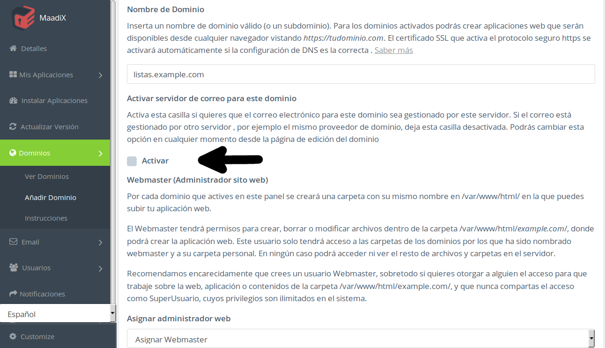
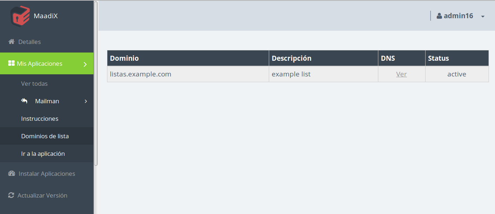

# Introducción  

Mailman es un software que permite crear y administrar listas de correo electrónico y boletines (newsletter), el cual comprende tres diferentes interfaces web diferentes.

* **Administración**    
* **Gestión de listas**    
* **Archivos de listas**    

Cuando la instalación de la aplicación de Mailman en tu servidor termine, se te enviará un correo electrónico que incluye el nombre de usuario y la contraseña del administrador de la aplicación.

# Cambiar contraseña  

Como para todas las demás aplicaciones que instales en el servidor, lo primero que harás es cambiar la contraseña del usuario administrador por razones de seguridad. Para hacerlo, haz clic en el icono de usuario arriba a la derecha y selecciona 'Account'. Se abrirá una página que te permitirá cambiar la contraseña, además de configurar otros parámetros.

# Configurar dominio

Las listas de correo funcionan bajo un dominio o subdominio propio. Esto significa que no puedes crear listas de correo utilizando el mismo dominio que estás utilizando para cuentas de email. En el caso que estés utilizando el dominio example.com para cuentas de de correo electrónico (admin@example.com, info@example.com....) no podrás utilizar el mismo para crear listas de correo. Lo que tendrás que hacer es crear un subdominio de example.com y configurar los DNS antes de empezar a crear listas.  

# Activar dominio o subdominio en Mailman

Para dar de alta un dominio o subdominio y poder empezar a crear listas de correo o boletines (newsletter), accede a la interfaz Mailman que encontrarás en https://minombreenmaadix.maadix.org/mailman, donde 'minombrenmaadix' será el nombre de tu subdominio en MaadiX. 
Una vez autenticado (pestaña 'Login' arriba a la derecha de la ventana), aparecerá la pestaña 'Domains' en el menú superior. Accede a esta página y haz clic en el botón 'Add Domain' (Añadir dominio).  
Como ejemplo utilizaremos listas.example.com, pero puedes asignar el nombre que prefieras (news.example.com, info.example.com...).

Tendrás que rellenar los tres campos siguientes:

* **Mail Host**: El nombre del dominio o subdominio bajo el cual se podrán crear listas (en nuestro caso listas.example.com, por el que tendremos que crear luego las entradas DNS correspondientes).  
* **Description**: Una descripción para el dominio o subdominio (opcional).  
* **Web Host**: La dirección web en la que será posible acceder a las opciones para las listas de este subdominio. Puedes dejar el valor por defecto minombrenmaadix.maadix.org o bien añadir otro dominio o subdominio, siempre que esté activado en el panel de control y funcionando correctamente. Esta será la dirección web que se enviará a los suscriptores para acciones tales como confirmar suscripción, consultar listas públicas u otras.  

En el caso de este ejemplo, el **Web Host** podría ser el dominio example.com o incluso el mismo subdominio listas.example.com, que deberá tener los DNS correctamente configurados para que apunten a tu servidor, y tendrá que estar activado en el panel de control. Si decides utilizar el mismo dominio o subdominio de las listas como dirección para la interfaz gráfica, es muy importante que no actives el servidor mail para él. Deberás entonces activar el subdominio listas.example.com en el panel de control, dentro de la sección 'Añadir Dominios', sin marcar la casilla 'Activar servidor de correo para este dominio'.  
De esta forma, se creará la configuración necesaria para que el subdominio listas.example.com se pueda visitar desde el navegador, sin que se active el servidor de correo. Si activaras el servidor de correo para un dominio que quisieras utilizar para las listas, podrías experimentar problemas en la entrega de los mensajes.  

# Crear listas de correo o boletines  

Una vez añadido un dominio a la aplicación Mailman, puedes crear una o más listas de correo o boletines bajo el mismo dominio. 
Para ello visita la pestaña Lists en el menú de arriba y luego haz clic en 'Add new List'.  

  

Tendrás que rellenar los siguientes campos:  

* **List Name**: El nombre de la lista. En el ejemplo, crearemos la lista 'info'.  
* **Mail Host**: El dominio para la listas. En el desplegable escogemos el subdominio recién creado lists.example.com.  
* **Initial list owner address**: Asignamos una cuenta de correo como propietaria / administradora de la lista.  
* **Advertise this list?**: Esta opción establece si la lista será visible publicamente en el listado de listas creadas o no. Para que se muestre, elegiremos 'Advertise this list in list index', mientras que si elegimos 'Hide this list in list index' solamente la verá el administrador.
* **Description**: Una descripción informativa de la lista (opcional).  

Una vez completada esta fase, ya habremos creado la lista. A continuación, tendremos que establecer nuestras preferencias de configuración.

# Configurar DNS para el dominio o subdominio  

Para que las listas creadas funcionen correctamente es necesario configurar los DNS para el dominio o subdominio añadido.  

Como primer paso, necesitas acceder a través del panel de control a los valores requeridos para los registros DNS.  
El panel de control detectará automáticamente los dominios o subdominios activados desde Mailman y te devolverá los valores correctos para las entradas DNS, que tendrás que configurar en el panel que te proporciona tu proveedor de dominio (operación externa a MaadiX).

Accede al panel de control y consulta la pestaña Mis Aplicaciones > Mailman > Dominios de listas en el menú de la columna izquierda. Te aparecerá un listado de todos los dominios añadidos desde Mailman.  

  

Haz clic en el enlace 'Ver' de la columna DNS del dominio o subdominio que quieras configurar.  

Aquí encontrarás los valores DNS necesarios para una correcta configuración. Si solamente quieres usar este dominio o subdominio para listas de correo, será suficiente que configures los DNS para los valores MX, TXT e idealmente DKM que encontrarás en la tabla 'Servidor de Correo'. 

Para crear un subdominio o configurar los DNS de un dominio existente, tendrás que entrar en el panel de administración que te proporciona tu proveedor (Gandi, Dinahosting, etc...). Lamentablemente, cada interfaz es diferente dependiendo del proveedor, de modo que no existe una manera única de llevar a cabo este proceso. Consulta la sección [DNS](dns) de esta guía de uso para más información.

