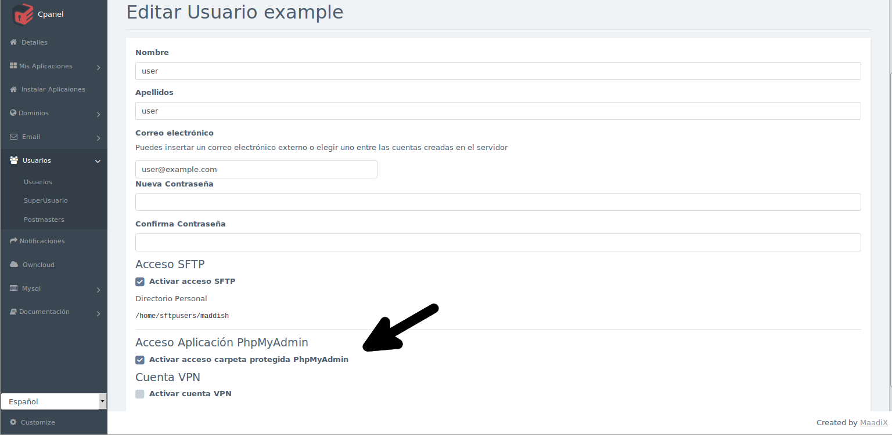
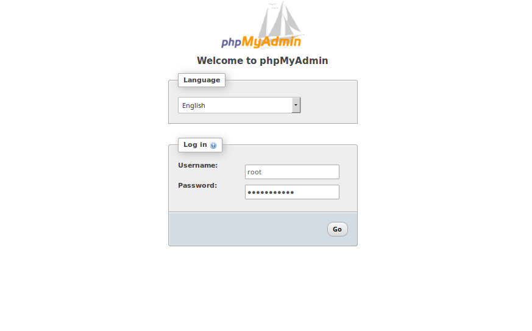
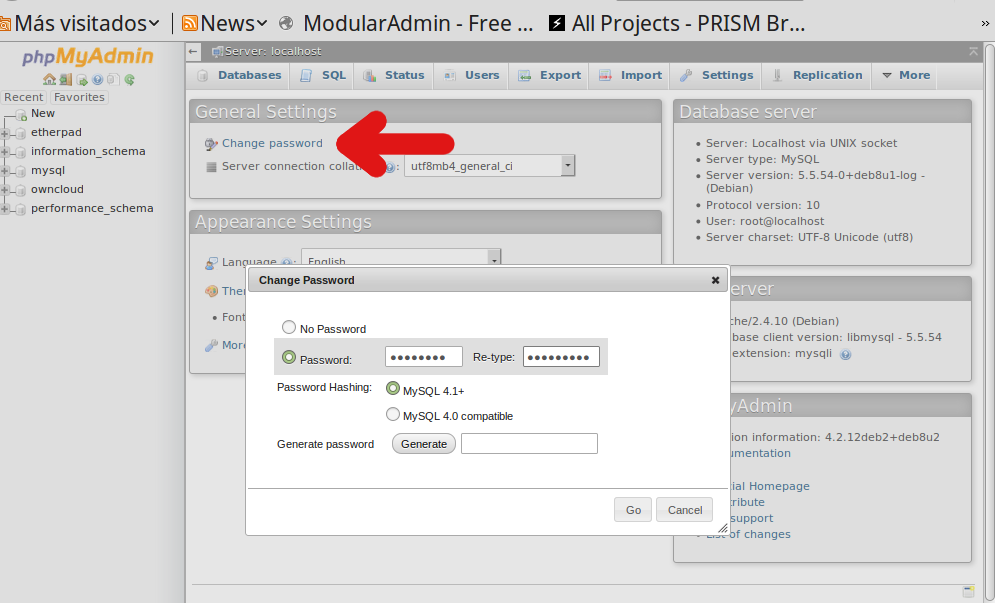

# Servidor MySQL

Cada máquina virtual dispone de un servidor MySQL propio.

En el correo electrónico de activación del servicio se envían las credenciales para el usuario root de MySQL. Por razones de seguridad, se recomienda cambiarlas cuando se accede por primera vez al servidor.  

Si se ha elegido no instalar la aplicación phpMyAdmin, solamente se podrán administrar las bases de datos y sus usuarios a través de la consola de comandos (terminal). En caso contrario, se puede utilizar esta aplicación para la gestión de las bases de datos y de sus usuarios.  

# phpMyAdmin

Se trata de una aplicación externa al panel de control, que permite administrar bases de datos y usuarios MySQL desde una interfaz gráfica.  

Por razones de seguridad, esta aplicación está protegida con una doble contraseña. Únicamente los usuarios que tengan activado el 'Acceso aplicación phpMyAdmin' podrán acceder a ella.
Puedes activar este acceso en el momento de crear nuevos usuarios, o editando el perfil de usuarios ya existentes.  

  

## Primera contraseña  

Cuando se accede a la aplicación phpMyAdmin, se muestra la primera autenticación con una ventana emergente. En este primer formulario se tienen que insertar las credenciales de usuario y contraseña de un usuario que tenga activado el servicio 'Acceso aplicación phpMyAdmin' (Advertencia: No se trata del usuario y contraseña de un usuario MySQL para una base datos o el usuario root de MySQL -- ese es el siguiente paso).  

## Segunda contraseña  
Una vez efectuada satisfactoriamente esta autenticación, se muestra la interfaz de la aplicación phpMyAdmin, que solicitará un usuario MySQL. Por defecto existe un usuario MySQL cuyo nombre es 'root' y la contraseña del cual está incluida en el correo electrónico que se envía en el momento de activar el servidor.

Por razones de seguridad, es muy recomendable cambiar la contraseña del usuario root. Puedes hacerlo desde la misma aplicación:

   

Es buena práctica crear un usuario MySQL diferente por cada base de datos, y otorgarle de este modo permisos solamente sobre una y no sobre todas las bases de datos que tengas creadas.

Tanto las bases de datos como los usuarios MySQL y sus contraseñas se pueden crear y administrar desde phpMyadmin.  
Por defecto, sólo el usuario 'root' de MySQL tiene los privilegios necesarios para crear nuevas bases de datos, nuevos usuarios y otorgar permisos a cada uno de ellos.  

En caso de que te quedaran dudas, siempre puedes consultar la documentación oficial para el uso de phpMyAdmin en el [siguiente enlace](https://www.phpmyadmin.net/docs/)
