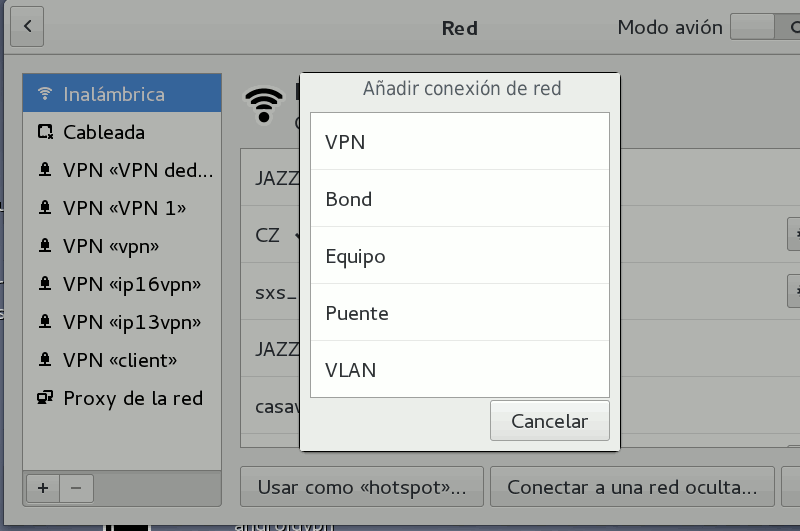
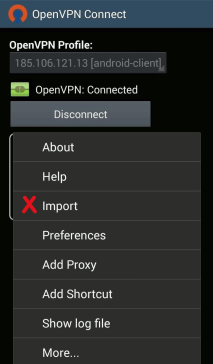
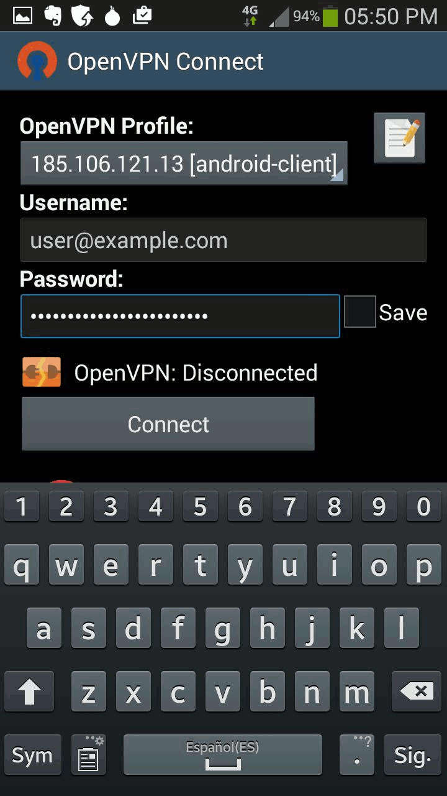
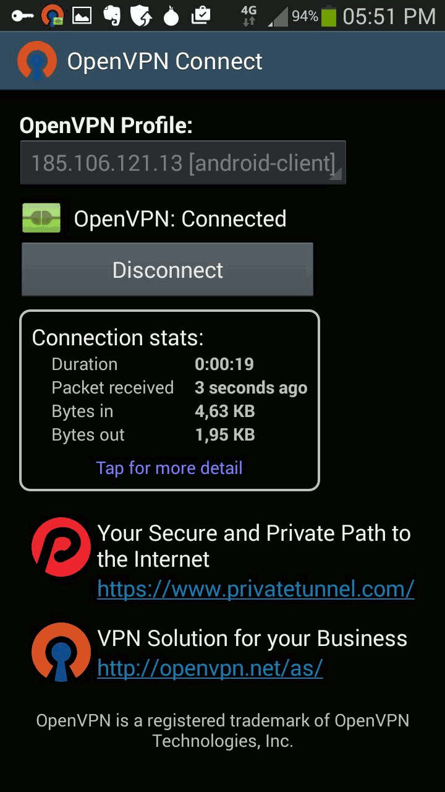

# VPN

Una red privada virtual o VPN ([Virtual Private Network - Wikipedia](https://es.wikipedia.org/wiki/Red_privada_virtual) ), es una tecnología de red que permite una extensión segura de tu red privada de área local (LAN) a través de una red pública sobre la que no tienes control como Internet.

La VPN de MaadiX te permite conectarte a tu servidor y gestionarlo utilizando una conexión cifrada y segura. Además de ello, puedes visitar cualquier dirección de Internet pasando primero a través de tu VPN. Esto te permite navergar de manera más segura si, por ejemplo, ests conectado a una red WiFi pública. 
  
Para empezar a usar la VPN de tu servidor debes llevar a cabo dos procesos:
* Crear o editar un usuario desde tu Cpanel para darle acceso a la VPN
* Instalar un programa 'cliente' en el dispositivo que quieres conectar a través de la VPN

# Crear o editar un usuario desde tu Cpanel para darle acceso a la VPN

1- Desde el Cpanel entra en la pestaña '**Usuarios**'. Puedes editar un usuario existente o crear uno nuevo.  

2- Entre los atributos disponibles verás '*Cuenta VPN*'. Marca esa casilla para activar la cuenta VPN para este usuario.  

3- Marca la casilla '*Enviar instrucciones*' para enviar al usuario un email con los archivos de configuración y las instrucciones para configurar el cliente VPN (nota: las instrucciones incluyen todos los datos necesarios menos la contraseña. Por razones de seguridad, proporciona al usuario la contraseña por otro canal).

# Instalar y configurar cliente OpenVPN 

La VPN de MaddiX funciona con OpenVPN. Es necesario instalar en los dispositivos que vayan a utilizarla el software de OpenVPN y añadir ciertas configuraciones. A continuación puedes encontrar un tutorial sencillo para diferentes sistemas operativos (Linux / MacOX / Windows) y para PC o móvil:

## Windows

1- Descarga e instalar la aplicación OpenVpn.

https://openvpn.net/index.php/open-source/downloads.html  

2- Toma nota de la ubicación de la aplicación. Una vez acabada la instalación, copia en la carpeta \config los dos archivos dentro de la carpeta `/windows/` que deben haberte llegado por correo cuando se activó tu cuenta de VPN. 
a) `vpn.ovpn`    
b) `ca.crt`  

NOTA: La ubicación por defecto es `C:\Program Files\OpenVPN`, así que tendrás que copiar ambos archivos en `C:\Program Files\OpenVPN\config\` a menos que durante la instalación hayas ubicado la aplicación en otra carpeta.

Si no has recibido ningún mail con instrucciones para instalar el cliente VPN y los archivos de configuración, solicita estos datos al administrador para que te lo reenvíe desde el Cpanel. 

3- Abre la aplicación OpenVPN GUI. Posiblemente se haya creado un acceso directo en tu escritorio.

4- Introduce el usuario y contraseña que debe haber proporcionado el administrador para la conexión.

Espera unos segundos hasta que se establezca la conexión. Para comprobar que la conexión se ha efectuado con éxito visita la web [http://cualesmiip.com/](http://cualesmiip.com/) activando y desactivando la VPN.  El resultado que te ofrece como 'Tu IP real' debería ser distinto.

## Linux

1- Instala el cliente OpenVpn si no lo tienes instalado todavía (muchas distribuciones de linux lo incluyen por defecto).   

Por consola:  

    sudo apt-get install netwotk-manager-openvpn
    sudo restart network-manager

Con Synaptic
Aplicaciones > Herramientas de Sistema > Gestor de paquetes Synaptic busca y selecciona netwotk-manager-openvpn  
Una vez seleccionado el paquete haz click en 'Aplicar', en la bandeja superior de la interfaz.

2- Haz click en 'Configuración de Red' desde el panel de Network Manager.  

3- Busca el botón 'Añadir' o '+' para  añadir la configuración y elige VPN  

4- Escoge la opción 'Importar desde un archivo'  

5- Selecciona el archivo vpn.conf que te han proporcionado  

Cuando se activa una cuenta VPN desde el Cpanel, hay la opción de enviar un email al nuevo usuario con  las instrucciones para configurar el cliente. En este mismo mail están adjuntos los archivos que tienes que guardar para una fácil configuración. Ambos archivos (vpn.conf y ca.crt) tienen que estar en la misma carpeta por lo que no los muevas. Simplemente importa el archio vpn.conf.   

6- Inserta un nombre para tu conexión el usuario que recibiste .Por razones de seguridad la contraseña no se envia por email. El administrador de sistema se encargará de hacertela llegar por el medio que considere más seguro. Elije el método de gestión de la contraseña (es aconsejable la opción 'Preguntar siempre')    

 

7- Vuelve al panel del Network Manager y activa la conexión recién creada
 

En unos segundos se crea la conexión. Para comprobar que la conexión se ha efectuado con éxito visita la web [http://cualesmiip.com/](http://cualesmiip.com/) activando y desactivando la VPN.  El resultado que te ofrece como 'Tu IP real' debería ser distinto.  

## Android

1- Descarga el cliente OpenVpn Connect para Android  

[Descargar OpenVpn Connect](https://play.google.com/store/apps/details?id=net.openvpn.openvpn&hl=es)

2- Lanza la aplicación y desde el menú escoge 'Import'  

3- Selecciona 'Import profile from SD card'  

4- Selecciona el archivo de configuración android-client.ovpn que  has previamente recibido y guardado en tu dispositivo    

Cuando se activa una cuenta VPN desde el Cpanel, hay la opción de enviar un email al nuevo usuario con  las instrucciones para configurar el cliente. En este mismo mail están adjuntos los archivos que tienes que guardar. Ambos archivos (android-client.ovpn y ca.crt) tienen que estar en la misma carpeta. Si no has recibido ningún mail solicita estos datos a la persona que tenga acceso de administrador al panel de control

5- Inserta el nombre de usuario y la contraseña  

6- Espera unos segundos hasta que se establezca la conexión  

 Espera unos segundos hasta que se establezca la conexión. Para comprobar que la conexión se ha efectuado con éxito visita la web [http://cualesmiip.com/](http://cualesmiip.com/) activando y desactivando la VPN.  El resultado que te ofrece como 'Tu IP real' debería ser distinto.

