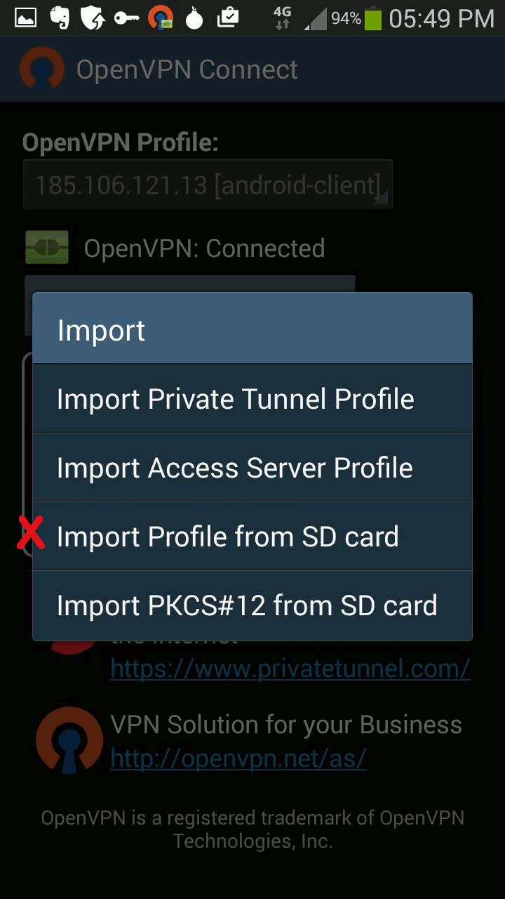
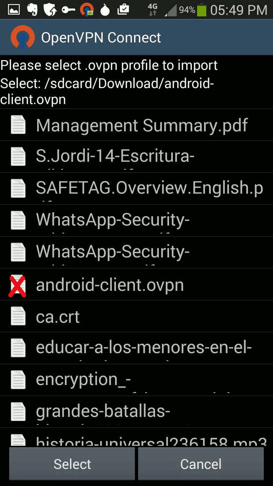

# VPN

Una red privada virtual (Virtual Private Network en inglés), es una tecnología de red que permite una extensión segura de la red de área local (LAN) sobre una red pública o no controlada como internet. 

Esto permite conectarse a otro dispositivo, en este caso tu servidor en MaadiX, a través de una conexión cifrada y segura, además de poder visitar cualquier dirección de internet utilizando esta misma comexión.  

Para saber más visita [VPN - Wikipedia](https://es.wikipedia.org/wiki/Red_privada_virtual)  
  
Para activar una conexión VPN con tu servidor necesitas crear el usuario en el Cpanel y tener instalado un programa  'cliente' en los dispositivo que se van a conectar.  

# Crear cuentas 

1- Desde el Cpanel entra en la pestaña 'Usuarios'. Puedes editar un usuario existente o crear uno nuevo.  
2- Entre los atributos disponibles verás 'Cuenta VPN'. Activa la casilla.  
3- Si quieres enviar indicaciones al usuario para configurar su conexión, activa la casilla 'Enviar email con instrucciones al usuario'  

# Instalar y configurar cliente  

## Windows

1- Descargar e instalar la aplicación OpenVpn  

https://openvpn.net/index.php/open-source/downloads.html  

2- Tomar nota de la ubicación de la aplicación y acabada la instalación copiar en la carpeta \config los dos archivos  
a) vpn.ovpn    
b) ca.crt  

NOTA: La ubicación por defecto es C:\Program Files\OpenVPN, así que tendrás que copiar ambos archivos en C:\Program Files\OpenVPN\config a menos que durante la instalación hayas ubicado la aplicación en otra carpeta 

Cuando se activa una cuenta VPN desde el Cpanel, hay la opción de enviar un email al nuevo usuario con  las instrucciones para configurar el cliente. En este mismo mail están adjuntos los archivos que tienes que copiar. Si no has recibido ningún mail solicita estos datos a la persona que tenga acceso de administrador al panel de control  

3- Abre la aplicación OpenVPN GUI   

4- Introduce el usuario y contraseña que te han proporcionado para la conexión  

 Espera unos segundos hasta que se establezca la conexión. Para comprobar que la conexión se ha efectuado con éxito visita la web [http://cualesmiip.com/](http://cualesmiip.com/) activando y desactivando la VPN.  El resultado que te ofrece como 'Tu IP real' debería ser distinto.

## Linux

1- Instala el cliente openVpn si no lo tienes instalado todavía (muchas distribuciones de linux lo incluyen por defecto)     

Por consola:  

    sudo apt-get install netwotk-manager-openvpn

Con Synaptic
Aplicaciones > Herramientas de Sistema > Gestor de paquetes Synaptic busca y selecciona netwotk-manager-openvpn  
Una vez seleccionado el paquete haz click en 'Aplicar', en la bandeja superir de la interfaz

2- Haz click en 'Configuración de Red' desde el panel de Network Manager  

3- Busca el botón 'Añadir' o '+' para  añadir la configuración y elige VPN  

4- Escoge la opción 'Importar desde un archivo'  

5- Selecciona el archivo vpn.conf que te han proporcionado  

Cuando se activa una cuenta VPN desde el Cpanel, hay la opción de enviar un email al nuevo usuario con  las instrucciones para configurar el cliente. En este mismo mail están adjuntos los archivos que tienes que guardar para una fácil configuración. Ambos archivos (vpn.conf y ca.crt) tienen que estar en la misma carpeta por lo que no los muevas. Simplemente importa el archio vpn.conf.   

6- Inserta un nombre para tu conexión el usuario que recibiste .Por razones de seguridad la contraseña no se envia por email. El administrador de sistema se encargará de hacertela llegar por el medio que considere más seguro. Elije el método de gestión de la contraseña (es aconsejable la opción 'Preguntar siempre')    

 

7- Vuelve al panel del Network Manager y activa la conexión recién creada
 

En unos segundos se crea la conexión. Para comprobar que la conexión se ha efectuado con éxito visita la web [http://cualesmiip.com/](http://cualesmiip.com/) activando y desactivando la VPN.  El resultado que te ofrece como 'Tu IP real' debería ser distinto.  

## Android

1- Descarga el cliente OpenVpn Connect para Android  

[Descargar OpenVpn Connect](https://play.google.com/store/apps/details?id=net.openvpn.openvpn&hl=es)

2- Lanza la aplicación y desde el menú escoge 'Import'  

3- Selecciona 'Import profile from SD card'  

4- Selecciona el archivo de configuración android-client.ovpn que  has previamente recibido y guardado en tu dispositivo    

Cuando se activa una cuenta VPN desde el Cpanel, hay la opción de enviar un email al nuevo usuario con  las instrucciones para configurar el cliente. En este mismo mail están adjuntos los archivos que tienes que guardar. Ambos archivos (android-client.ovpn y ca.crt) tienen que estar en la misma carpeta. Si no has recibido ningún mail solicita estos datos a la persona que tenga acceso de administrador al panel de control

5- Inserta el nombre de usuario y la contraseña  

6- Espera unos segundos hasta que se establezca la conexión  

 Espera unos segundos hasta que se establezca la conexión. Para comprobar que la conexión se ha efectuado con éxito visita la web [http://cualesmiip.com/](http://cualesmiip.com/) activando y desactivando la VPN.  El resultado que te ofrece como 'Tu IP real' debería ser distinto.

